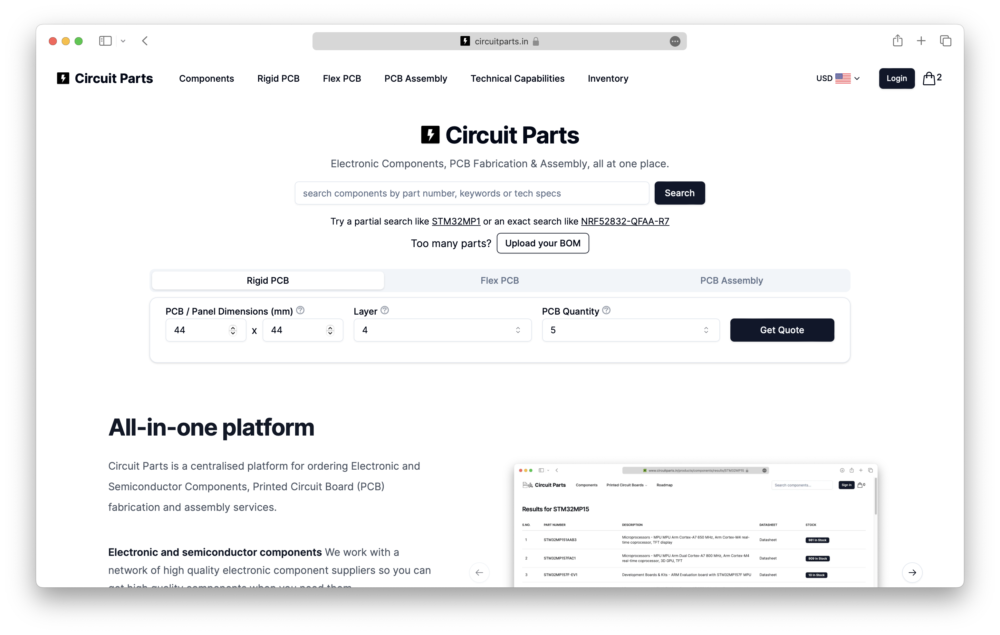

<a href="https://www.circuitparts.in">
  <h1 align="center">Circuit Parts | Open-source, digital quote-to-order platform designed to streamline the sourcing of Embedded Electronic parts.</h1>
</a>

  Buy Electronic & Semiconductor Components, Order PCB Fabrication and Assembly Services. All at one place.

  <a href="https://discord.gg/B4CCqBEH"><strong>Discord</strong></a> ·
  <a href="https://www.circuitparts.in"><strong>Website</strong></a> ·
  <a href="https://github.com/circuitparts/store/issues"><strong>Issues</strong></a> ·
  <a href="#roadmap"><strong>Roadmap</strong></a>

## About Circuit Parts

[Circuit Parts](https://www.circuitparts.in) was founded in 2022 to eliminate a major bottleneck in Hardware development: sourcing electronic and semiconductor parts for your project. The traditional process of finding, vetting, and managing suppliers, getting quotes, and tracking orders across many component distributors and PCB design houses is incredibly resource-intensive and prone to miscommunication, delays, and mistakes. These barriers make hardware development a slow, painful, high-risk endeavor.

We engineered a new approach — A digital quote-to-order platform. It provides a convenient place for individuals and businesses to purchase electronic and semiconductor components, upload designs and receive instant quotes for PCB fabrication and assembly, all in one place, eliminating the need to navigate multiple websites.

## Built with 🛠️

-   [Next.js](https://nextjs.org) - React framework for building performant apps.
-   [Clerk](https://clerk.com) - Handling user authentication.
-   [Tailwind CSS](https://tailwindcss.com) - CSS framework.
-   [MongoDB Atlas](https://www.mongodb.com/atlas/database) - Fully managed MongoDB in the cloud.
-   [Tailwind Headless UI](https://headlessui.com/) - Unstyled Headless UI components.
-   [shadcn/ui](https://ui.shadcn.com) - Pre-built Components Library
-   [Upstash](https://upstash.com/) - Serverless Redis for Caching.
-   [Amazon S3](https://aws.amazon.com/s3/) - Object storage.
-   [Formik](https://formik.org/) - Build forms in React.
-   [Yup](https://www.npmjs.com/package/yup) & [Zod](https://zod.dev/) - Schema builder for runtime value parsing and validation
-   [Resend](https://resend.com/) - Emailing service.
-   [Stripe](https://stripe.com) - Payments hanlding infrastucture.
-   [Playwright](https://playwright.dev/) - Reliable end-to-end testing for web apps.
-   [Vercel](https://vercel.com/) - Deploying nextjs apps.

## Documentation

Head over to our [Docs](https://circuitparts.in/docs) page to view the full documentation.

## Community

The Circuit Parts developer community can be found on [GitHub Discussions](https://github.com/circuitparts/store/discussions) where you can ask questions, share ideas, and show case your contributions with other people.

To chat with other community members you can join the [Circuit Parts Discord server]("https://discord.gg/B4CCqBEH").

Do note that our [Code of Conduct](CODE_OF_CONDUCT.md) applies to all our community channels. Users are highly encouraged to read and adhere to them to avoid repercussions.

## Stay Up-to-Date ⭐️

Go ahead and hit the star button located at the top right of this page to keep track of the progress.

## Contributing

Contributions to Circuit Parts are welcome and highly appreciated. However, before you jump right into it, we would like you to review our [Contribution Guidelines](https://www.circuitparts.in/contributions/how-to-contribute) to make sure you have a smooth experience contributing to this project.

## Getting Started

Head over to our [Docs](https://www.circuitparts.in/docs) page to find instructions on how to setup the project on your local machine and start tinkering. Happy coding!

## Security

Check out our [Security Policy](SECURITY.md) to understand how we handle security vulnerabilities.
