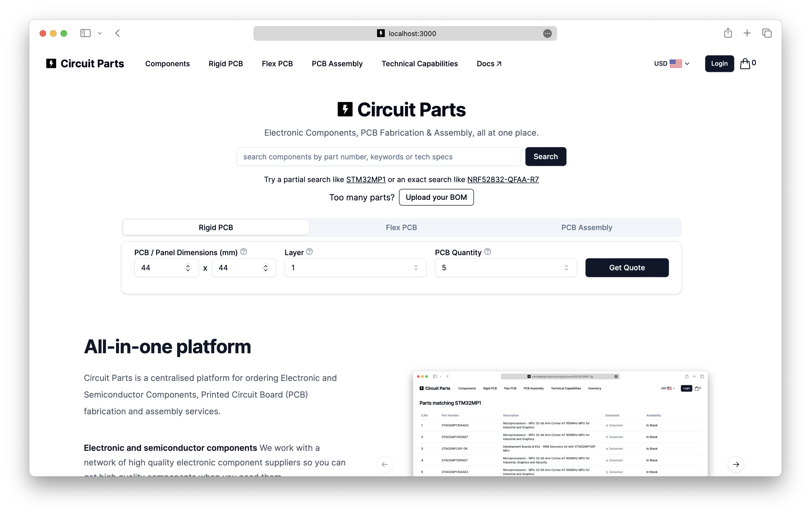

import { Steps } from "nextra/components";

# Installation

This guide will walk you through the process of setting up the Circuit Parts project on your local machine. It's going to be a little bit of work to signup for few services and setup the environmental variable but it's going to be worth it!

Get yourself a cup of coffee ☕️ and let's get started!

## System Requirements

Here is what you need to be able to run Circuit Parts

-   [Git](https://git-scm.com/)
-   [Node.js 18.17](https://nodejs.org/) or later.
-   [npm](https://docs.npmjs.com/) (recommended)
-   macOS, Windows (including [WSL](https://learn.microsoft.com/en-us/windows/wsl/)), and Linux are supported.
-   Code Editor ([VSCode](https://code.visualstudio.com/) recommended)

## Project Setup

Follow these steps to set up the project on your local machine:

<Steps>

### Forking Repository

Navigate to the [Circuit Parts GitHub repository](https://github.com/circuitparts/store) and click the "Fork" button in the top right corner of the page. This will create a copy of the repository in your GitHub account. See [Forking a repository](https://docs.github.com/en/pull-requests/collaborating-with-pull-requests/working-with-forks/fork-a-repo) for more information.

    

### Cloning Respository

[Clone](https://docs.github.com/en/pull-requests/collaborating-with-pull-requests/working-with-forks/fork-a-repo#cloning-your-forked-repository) the repository to your local machine by running the following command in your terminal. This will create a copy of the repository on your local machine.

```bash
git clone https://github.com/circuitparts/store.git
```

### Install Dependencies

Navigate to the project folder and install the required dependencies by running the following command in your terminal.

```bash
cd store
npm install
```

### Environment Variables

Setup your environment variables by copying the `.env.example` file to `.env.local` and replace the placeholders with the applicable keys. For database and storage setup, see the next sections.

```bash
cp .env.example .env.local
```

### Setup Database

-   Start at the [MongoDB Atlas registration page](https://account.mongodb.com/account/register) to register for a new Atlas account. Alternatively, you can log in if you already have an account.
-   If you are registering for a new account, Atlas creates an organization and project for you. You can also create them on your own.
-   With your organization and project created, you can now [deploy a free cluster](https://www.mongodb.com/docs/atlas/tutorial/deploy-free-tier-cluster/) that will be used to store your data.
-   Go to the overview page for your project. Click the **Create** button to create a new cluster.
-   Select the M0 option. This is the free tier and will be sufficient for working with this project.
-   Choose a cloud provider and region for your cluster. The default options are fine for this project.
-   Click the **Create** button at the bottom of the page to deploy the cluster and The **Security Quickstart** wizard appears.
-   Create a **database user** by specifying a **username** and **password**. Make sure to save the username and password as you will need them later.
-   MongoDB will automatically add your IP address to the **IP Access List**. Alternatively, you can add **0.0.0.0/0** to the list to allow access from any IP address. **This is not recommended for production environments.**
-   Click the **Finish and Close** button to complete the setup.
-   In the overview page, click the **Connect** button to connect to your cluster. Select any method and copy the connection string. Your connection string should look something like this:
    `mongodb+srv://<project_name>:<password>@<cluster_name>.<xxxx>.mongodb.net/?retryWrites=true&w=majority`
-   Replace `<password>` with the password for the user you created earlier and add it to your `.env.local` file.

### Setup AWS S3

This project uses AWS S3 for storing design files uploaded by users from the PCB Fabrication Order page:

-   Signup for [AWS](https://portal.aws.amazon.com/billing/signup) and follow on-screen instructions to create an account. When you sign up for an AWS account, an AWS account root user is created. The root user has access to all AWS services and resources in the account.
-   **(Optinal Setup)** Secure your AWS root user by turning on multi-factor authentication (MFA). See [Enabling a virtual MFA device](https://docs.aws.amazon.com/IAM/latest/UserGuide/enable-virt-mfa-for-root.html) for more information. As a security best practice, assign [administrative access](https://docs.aws.amazon.com/singlesignon/latest/userguide/getting-started.html) to an administrative user, and use only the root user to perform tasks that require [root user access](https://docs.aws.amazon.com/accounts/latest/reference/root-user-tasks.html)
-   Open the Amazon S3 console at [https://console.aws.amazon.com/s3/](https://console.aws.amazon.com/s3/).
-   Click the **Create bucket** button to open the Create bucket wizard.
-   For **Region**, choose the AWS Region where you want the bucket to reside. Ideally choose a region that is closest to you to reduce latency.
-   In the **Bucket name** field, enter a unique name for your bucket. The bucket name must be unique across all existing bucket names in Amazon S3. If you receive an error, try a different bucket name.
-   The default settings should be for this project. Just make sure under Object Ownership, **ACLs disabled (recommended)** is **enabled** and under Block Public Access settings for this bucket, **Block \***all**\* public access** is **enabled**.
-   Click **Create bucket** to create your bucket.
-   Click on the bucket you just created and navigate to the **Permissions** tab. Click on **Cross-origin resource sharing (CORS)** and add the following policy in the editor:

          ```json
          [
          	{
          		"AllowedHeaders": ["*"],
          		"AllowedMethods": ["GET", "POST", "PUT", "DELETE"],
          		"AllowedOrigins": [
          			"http://localhost:3000",
          			"http://localhost:3000/*",
          			"<optinally_add_your_own_domain_here>"
          		],
          		"ExposeHeaders": []
          	}
          ]
          ```

-   Click **Save** to save the policy.
-   Go to **Properties** tab and in **Bucket overview** section, copy the **Bucket ARN**. You will need this to create a policy for the IAM user.
-   Copy the **Bucket ARN** and **Region** and add it to your `.env.local` file.
-   Create a new **IAM user**. On the search bar type **IAM** and click on the **IAM** service. Click on **Users** from the left sidebar and click on **Create user**.
-   Enter a **username** and click **Next**
-   Click on **Attach existing policies directly** and click on **Create policy** to open a new window. Click on the **JSON** tab and add the following policy:

          ```json
          {
          	"Version": "2012-10-17",
          	"Statement": [
          		{
          			"Sid": "Statement1",
          			"Effect": "Allow",
          			"Action": ["s3:ListBucket", "s3:DeleteObject", "s3:GetObject", "s3:PutObject"],
          			"Resource": ["<your_bucket_arn>"]
          		}
          	]
          }
          ```

          Replace `<your_bucket_arn>` with the **Bucket ARN** you copied earlier.

-   Click **Review policy** and give your policy a name and description. Click **Create policy** to create the policy.
-   Go back to the previous window and under **Permissions polices** section click **Refresh** icon. Search for the policy you just created and select it. Click **Next** and then **Create user**.
-   Review the user details and click **Create user**.
-   In the users list, click on the user you just created and navigate to the **Security credentials** tab. Click on **Create access key** and save the **Access key ID** and **Secret access key**. Add these keys to your `.env.local` file.
-   Copy the **User ARN** from the summary tab. You will need this to add it to the bucket policy.
-   Go back to the **Permissions** tab of your bucket and click on **Bucket policy**. Add the following policy in the editor:

          ```json
          {
          	"Version": "2012-10-17",
          	"Statement": [
          		{
          			"Sid": "Statement1",
          			"Effect": "Allow",
          			"Principal": {
          				"AWS": ["<your_user_arn>"]
          			},
          			"Action": ["s3:ListBucket", "s3:DeleteObject", "s3:GetObject", "s3:PutObject"],
          			"Resource": ["<your_bucket_arn>", "<your_bucket_arn>/*"]
          		}
          	]
          }
          ```

          Replace `<your_user_arn>` with the **User ARN** you copied earlier and `<your_bucket_arn>` with the **Bucket ARN** you copied earlier. Take a close look at the **Resource** field. It should have the bucket ARN and the bucket ARN with **`/*`** at the end.

-   Click **Save** to save the policy.
-   You have successfully setup your S3 bucket. Add the **Access key ID**, **Secret access key**, **Bucket name**, **Region** and **Bucket ARN** to your `.env.local` file.

### Building

-   Build the project by running the following command in your terminal. This will create a development build of the project and start the development server.

```bash
npm run build
```

-   Open [http://localhost:3000](http://localhost:3000) with your browser to see the result.

    

    You should see the Circuit Parts homepage. If you see this, congratulations! You have successfully setup the project on your local machine.

    If you see any errors, please refer to the [Troubleshooting](#troubleshooting) section.

</Steps>

Uff! That was a lot of work but you did it! Congratulations 🎉

## VS Code Setup

This project is best developed using [Visual Studio Code](https://code.visualstudio.com/). It is a lightweight but powerful source code editor which runs on your desktop and is available for Windows, macOS and Linux.

For the best experience, we recommend installing the following extensions:

1. [ESLint](https://marketplace.visualstudio.com/items?itemName=dbaeumer.vscode-eslint) - Integrates ESLint JavaScript into VS Code.
2. [Prettier](https://marketplace.visualstudio.com/items?itemName=esbenp.prettier-vscode) - Code formatter using prettier.
3. [Tailwind CSS IntelliSense](https://marketplace.visualstudio.com/items?itemName=bradlc.vscode-tailwindcss) - Intelligent Tailwind CSS tooling for VS Code.
4. [MongoDB for VS Code](https://marketplace.visualstudio.com/items?itemName=mongodb.mongodb-vscode) - MongoDB extension for VS Code.
5. [Playwright Test](https://marketplace.visualstudio.com/items?itemName=ms-playwright.playwright-test) - Playwright Test extension for VS Code.

## Troubleshooting

1. **Invalid environment variables**
    - If you see this error, make sure you have copied the `.env.example` file to `.env.local` and replaced the placeholders with the applicable keys. Read the above instructions carefully and make sure you have followed all the steps.
2. **MongoDB connection failed**
    - If you see this error, make sure you have replaced the placeholders in the `.env.local` file with the correct connection string. Make sure you have followed the [Database Setup](#database-setup) section carefully.
3. **AWS S3 connection failed**
    - If you see this error, make sure you have replaced the placeholders in the `.env.local` file with the correct keys. Make sure you have followed the [AWS S3 Storage Setup](#aws-s3-storage-setup) section carefully.
4. **Build failed**
    - If you see this error, make sure you have installed the required dependencies by running the `npm install` command in the project folder. Make sure you have followed the [Project Setup](#project-setup) section carefully.
5. **Page not found**
    - If you see this error, make sure you have started the development server by running the `npm run build` command in the project folder and opened [http://localhost:3000](http://localhost:3000) with your browser. This project is setup to run on port 3000 by default. If you have changed the port, make sure to open the correct port in your browser.
6. **Other errors**
    - If you see any other errors, please raise an issue in the [Issues tab](https://github.com/circuitparts/store/issues). But before you do that, make sure to check if the issue has already been raised by someone else. If it has, please add a comment to the existing issue instead of creating a new one.

We will keep updating this guide with more troubleshooting tips as we come across more issues.
