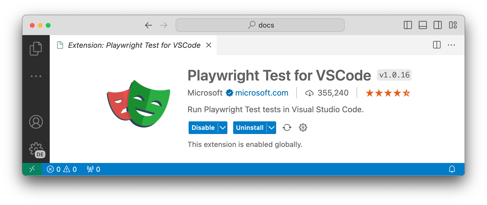
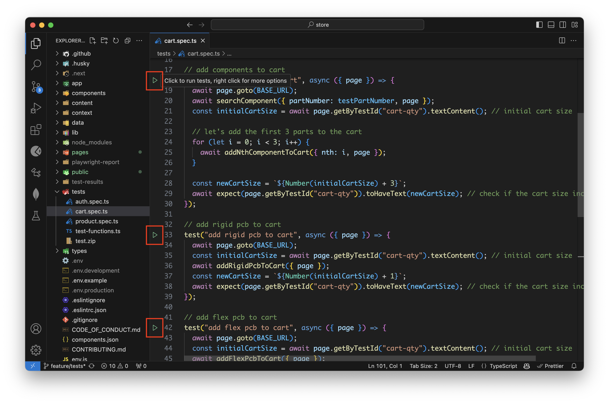
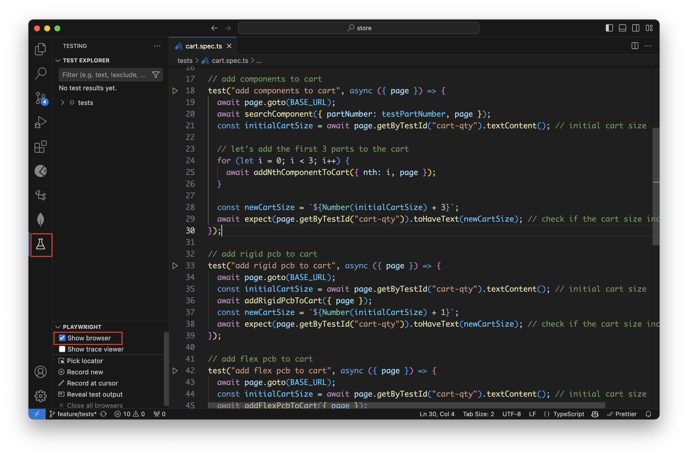
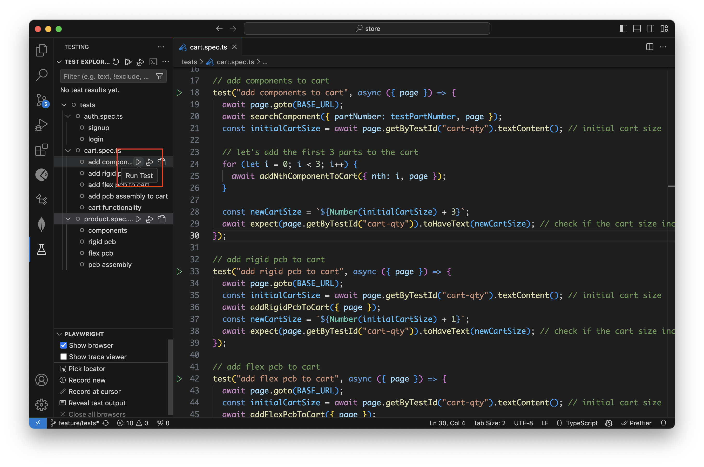

import { Callout } from 'nextra/components'
 
# Testing

Testing is an important part of the development process. It helps to ensure that the code is working as expected and is not breaking any existing functionality or introducing new bugs.

The tests folder contains all the test files for our application. We use [Playwright](https://playwright.dev/) for end-to-end testing.

## Setting up Playwright

Playwright is installed as a dev dependency in the project. You can either use it directly from the CLI or use the VSCode extension to run the tests. We recommend using the [VSCode extension](https://playwright.dev/docs/getting-started-vscode) as it provides a better experience.

### Installing the VSCode extension

-   Install the [VSCode extension from the marketplace](https://marketplace.visualstudio.com/items?itemName=ms-playwright.playwright) or from the extensions tab in VSCode.

<Callout type="info">
	Playwright is configured to run tests in Chromium by default. This configuration can be changed in the
	`playwright.config.ts` file.
</Callout>

## Structure

You can find the tests in the `tests` folder at the root of the project. The tests folder is structured as follows:

-   `product.spec.ts`: Contains tests for product-related functionalities such as searching for a product, viewing product details, etc.
-   `cart.spec.ts`: Contains tests for cart-related functionalities such as adding products to the cart, removing products from the cart, etc.
-   `auth.spec.ts`: Contains tests for authentication-related functionalities such as logging in, signing up, etc.
-   `test-functions.ts`: Contains helper functions that are used across multiple test files.
-   `test.zip`: Contains demo upload files for testing.

## Running the tests

### Headless mode

Open a test file with the `.spec.ts` extension to run the tests. You can run a single test by clicking the green triangle next to your test block to run your test. Playwright will run through each line of the test and when it finishes you will see a green tick next to your test block as well as the time it took to run the test.

<Callout type="info">By default, Playwright will run the tests in headless mode.</Callout>

### Show browser

You can also run your tests and show the browsers by selecting the option Show Browsers in the testing sidebar. Then when you click the green triangle to run your test the browser will open and you will visually see it run through your test. Leave this selected if you want browsers open for all your tests or uncheck it if you prefer your tests to run in headless mode with no browser open.

### Run all tests

View all tests in the testing sidebar and extend the tests by clicking on each test. Tests that have not been run will not have the green check next to them. Run all tests by clicking on the white triangle as you hover over the tests in the testing sidebar.

For more information on Playwright, refer to the [official documentation](https://playwright.dev/docs/intro).
