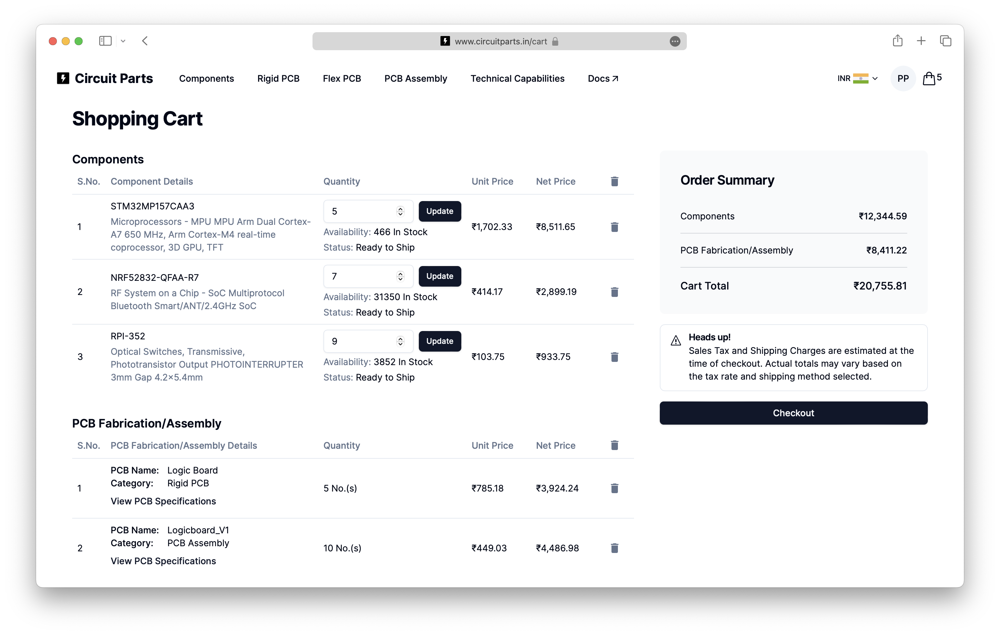

# Manage your Cart

When you click on the **"Add to Cart"** button, your item will be added to your cart. You can view your cart by clicking on the cart icon located in the top right corner of the page. You can view the items you have added, the quantity of each item, the unit and net prices for each item.

## Components Table

The Components table displays the components you have added to your cart. This table will not be displayed if you have not added any components to your cart.

### Update component quantity

-   You can update the quantity of each component in your cart by clicking on the **"Up"** and **"Down"** arrows located next to the quantity of each component in the Components Table.
-   You can also **manually input** the quantity of each component in the input field.
-   The **"Available Stock"** of each component is also displayed in the Components Table. If the quantity of a component is more than the available stock, the component will be backordered and the **"Backordered"** status will be displayed in the **"Status"** of the component.
-   After you have updated the quantity click on the **"Update"** button to update the quantity of the component in your cart. The **"Net Price"** will be updated based on the new quantity.

### Remove component(s) from your cart

-   You can **remove single** component from your cart by clicking on the **"Bin"** icon located next to the components's net price in the components table **body**.
-   If you want to **remove all** the components from your cart, you can click on the **"Bin"** icon located on the components table **header** right beside the "Net Price" heading.

## PCB Fabrication/Assembly Table

The PCB Fabrication/Assembly table displays the PCB Fabrication and Assembly services you have added to your cart. This table will not be displayed if you have not added any PCB Fabrication or Assembly services to your cart.

The **"Category"** under the **PCB Name** will display the type of PCB service you have added to your cart (e.g. "Rigid PCB", "Flex PCB", "PCB Assembly", etc.).

### View PCB specifications

-   You can view the specifications of the PCB service you have added to your cart by clicking on the **"View PCB Specifications"** button located under the each PCB service in the PCB Fabrication/Assembly Table.
-   On clicking the **"View PCB Specifications"** button, a modal will be displayed showing the specifications of the PCB service you have added to your cart.
-   You can close the modal by clicking on the **"Got it, thanks!"** button located at the bottom of the modal or by clicking outside the modal.

### Remove PCB service(s) from your cart

-   You can **remove single** PCB service from your cart by clicking on the **"Bin"** icon located next to the PCB service's net price in the PCB Fabrication/Assembly table **body**.
-   If you want to **remove all** the PCB services from your cart, you can click on the **"Bin"** icon located on the PCB Fabrication/Assembly table **header** right beside the "Net Price" heading.

## Next up
Learn how to checkout and place an order. Click checkout guide button below to continue.