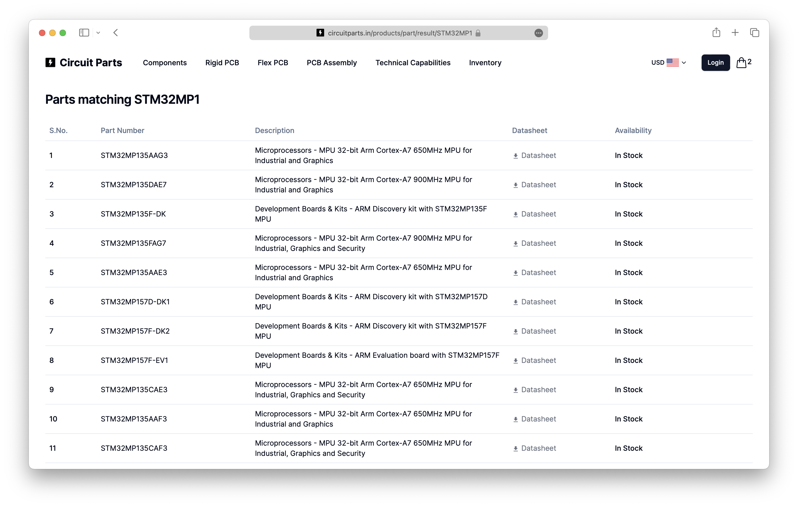
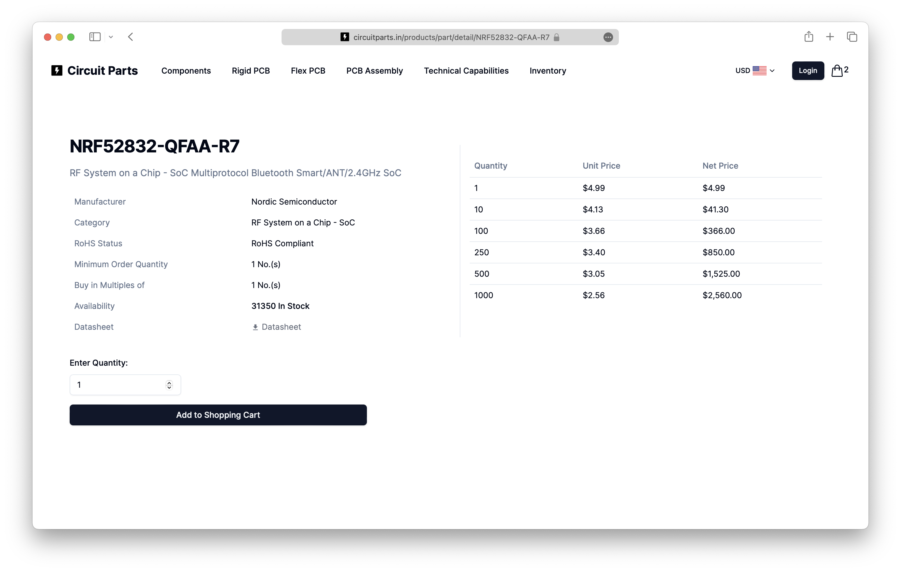

import { Steps } from "nextra/components";

# How to search and order components

<Steps>

### Signup or Login

If you haven't already, sign up for a free Circuit Parts account. [Sign up now](https://circuitparts.in/auth/signup) or [Login](https://circuitparts.in/auth/login) if you already have an account.

### Search for components

On the home page, you can search for components using the search bar. You can search by part number, description, or category. Try searching for "resistor" or "LED". You can also enter a part number directly. Try entering partial part number like STM32MP1 or an exact part number like NRF52832-QFAA-R7.

### View search results

If there are multiple parts matching your search query, you will see a list of parts as shown below. Click on the part number that you are interested in.

### View component details

After you click on a part number, you will see the part details. You can see the part number, description, price, and stock status. You can also see the datasheet and other related documents if available.

### Add component to cart

Enter the quantity you want to order and click on "Add to cart" to add the part to your cart. Optinally if the part is not in stock, you can still add to cart for backorder.

</Steps>
