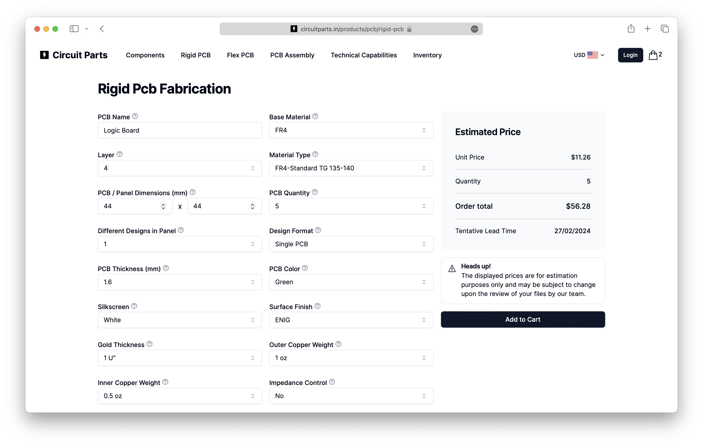

import { Steps } from "nextra/components";

# How to order PCBs

<Steps>

### Signup or Login

If you haven't already, sign up for a free Circuit Parts account. [Sign up now](https://circuitparts.in/auth/signup) or [Login](https://circuitparts.in/auth/login) if you already have an account.

### Select PCB type

On the top navigation bar, you'll find options for [Rigid PCB](https://circuitparts.in/products/pcb/rigid-pcb),
[Flex PCB](https://circuitparts.in/products/pcb/flex-pcb) and [PCB Assembly](https://circuitparts.in/products/pcb/assembly).
Click on the type of PCB you want to order. You will be taken to the respective PCB fabrication form to fill in the specifications.

### Fill in PCB specifications

Fill in the PCB specifications such as board size, quantity, layers, material, thickness, surface finish, copper weight, etc. and see the price instantly.
Make sure to fill in all the required fields to get an estimate.

### Upload Gerber files

After filling in the PCB specifications, you can upload the Gerber files for your PCB. Click the "Choose file" button to upload the Gerber files. At the moment, you can
only upload a single zip file containing all the Gerber files. If you have multiple files, you can zip them and upload them as a single file.

### View PCB quote

As you fill in the PCB specifications the price estimate gets updated in real-time. You'll also be able to view the estimated delivery time for your PCB.

### Add to cart

Once you have filled in all the required fields and uploaded the Gerber files, click the "Add to Cart" button to add the PCB to your cart.

</Steps>
